# fmss_bootcamp_finalcase
Fmss Full-Stack Bootcamp final project

## Hakkında
Emlak uygulamasında kullanıcılar bu sistem üzerinden ilan oluşturabilir, düzenleyebilir, silebilir ve detaylarına ulaşabilirler. Kendi ilanlarını aktif ve pasif duruma getirebilir  ve paket satın alıp kendi ilanları için kullanabilir
- Java 21
- Next.js
- Jwt Token Auth
- Microservice
- PostgreSql and MongoDb
- RabbitMQ
- Restfull
- Junit

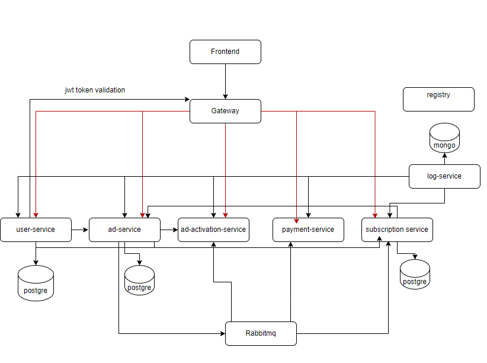

### Backend Sistem Kabulleri
- Ürün oluşturmak için yeni bir servis yazımına gerek yoktur. Sistem içerisinde tanımlanmaları yeterlidir.

- Ürünler adet bazlı satılmaktadır.

- Ürünler 10’ar adet olarak satın alınabilmektedir.

- Ürünün geçerlilik 1 ay yani 30 gün ile sınırlıdır.

- Ödeme işlemi için sisteme gerekli kayıtların yazılması yeterlidir.

- Ödeme işlemi senkron yapılmalıdır.

- İlanlar varsayılan olarak kaydedildiğinde IN_REVIEW statüsündedir. Asenkron olarak başka  bir servis ACTIVE olarak değiştirmelidir.

- Kullanıcılar ilanları sadece ACTIVE ve PASSIVE statülerine güncelleyebilir.

### Frontend Gereksinimler

- Kullanıcıların giriş yapabilmesi için bir login sayfası. Burada gerekli validasyonlar yapılacak. Boş kullanıcı adı, şifre gönderilememeli. Yanlış bir şifre girilirse, toast şeklinde bir uyarı notification’u çıkmalı.

- İlanların liste halinde gözüktüğü bir dashboard. Tablo veya kart şeklinde bir liste olabilir. Bu liste’de pagination veya infinitive scroll olmalı. Bu sayfada yeni ilan oluşturma butonu olacak. Tıklayınca bir modal açılacak ve oradan yeni ilan oluşturulabilecek.

- Her ilan’ın edit ve delete butonları olacak. İlanlar editlenebilip, silinebilecek. Edit kısmından ilan aktif veya pasif duruma getirilebilir.

- Kullanıcıların aktif ve pasif ilanlarını görüntüleyebilmesi. Listeleme sayfasında bir filtreleme olacak ve ona göre ilanları filtreleyebilecek.

- Kullanıcılar ilanlara tıklayarak onların detay sayfasına gidip ilan detaylarını görebilecek.

- Son olarak da kullanıcıların paket bilgilerini göreceği bir arayüz sayfasıyapılacak.

- Totalde 4 sayfa olacak: login sayfası, listeleme sayfası, ilan detayı sayfası, paket sayfası.

## Kurulum

- postgre, pg admin, rabbitmq, mongoDB , mongoExpress için docker-compose up -d

- servisler çalıştırılmadan önce http://localhost:15672/#/queues username:admin,password:123456
- send-subscription-queue
- send-ad-activation-queue
- send-log-queue
- kuyrukları manuel eklenmesi gerekebilir
####
- Next.js için
- npm i
- npm run build
- npm run start

## Test coverage

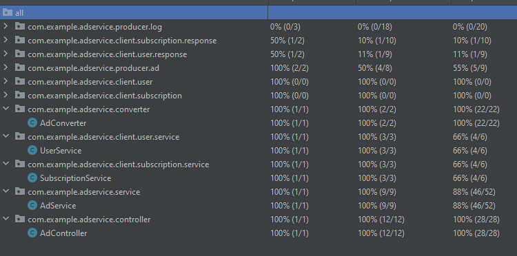
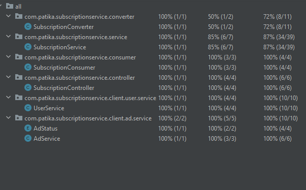
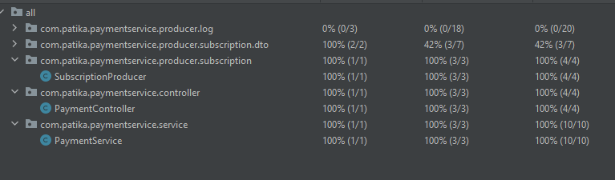
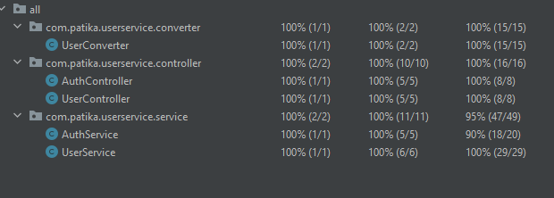

## Ekran görüntüsü 

- /giris
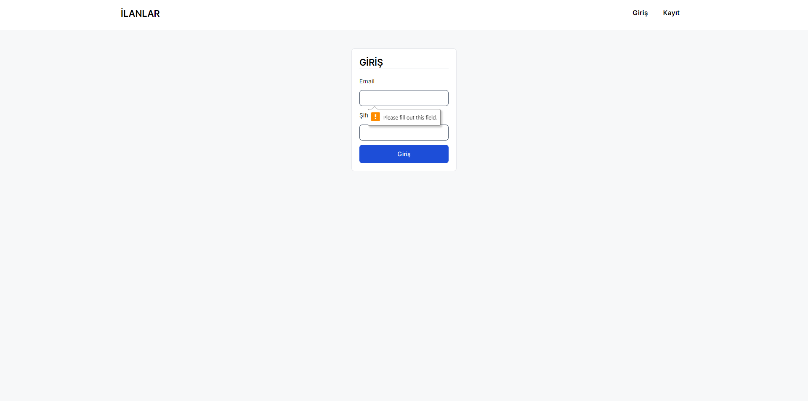
- kayit
  
- /ilan/sayfa/{page}
  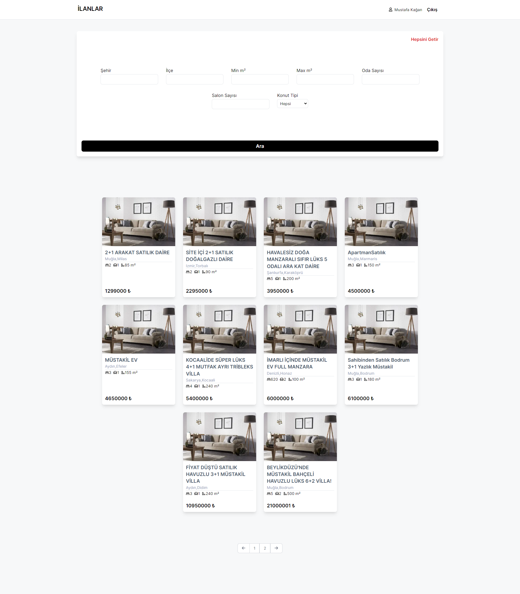
- /user/{id}/ilan
  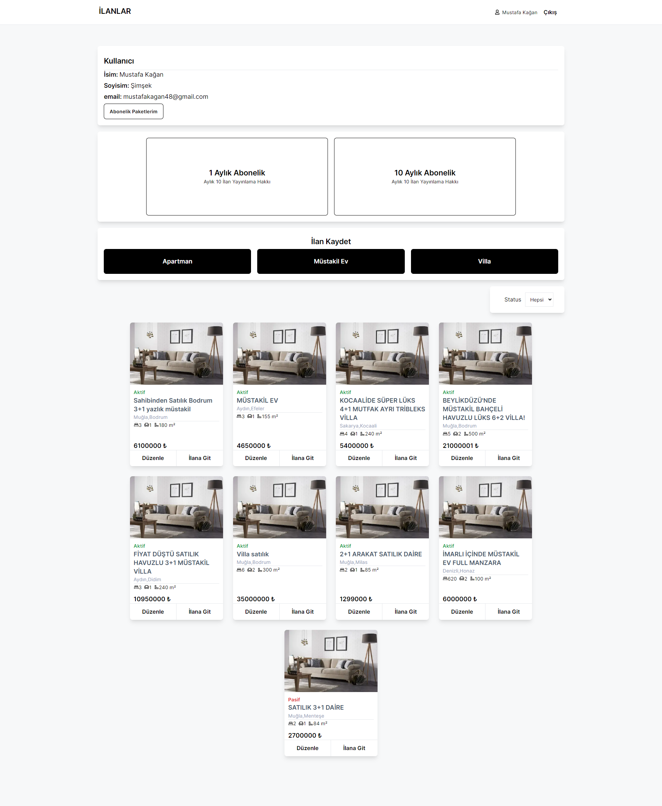
- ilan/{id}
  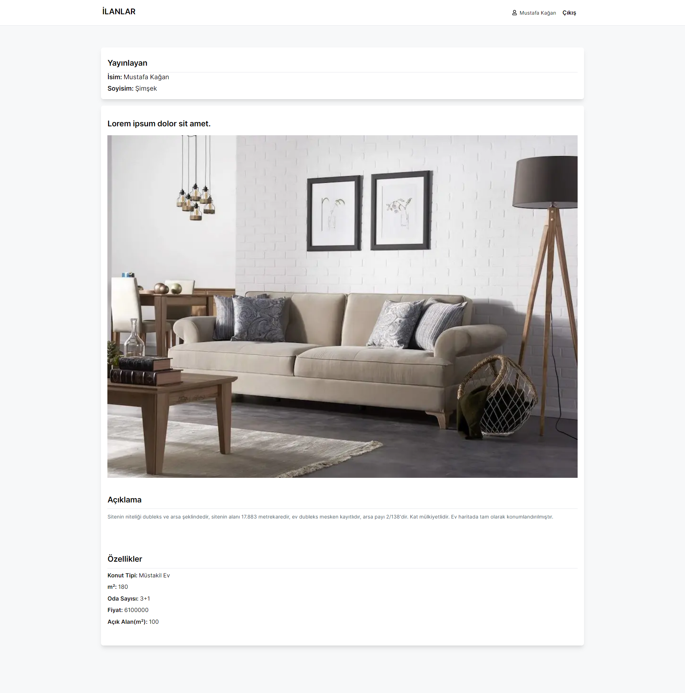
- user/{id}/abonelik-bilgileri
  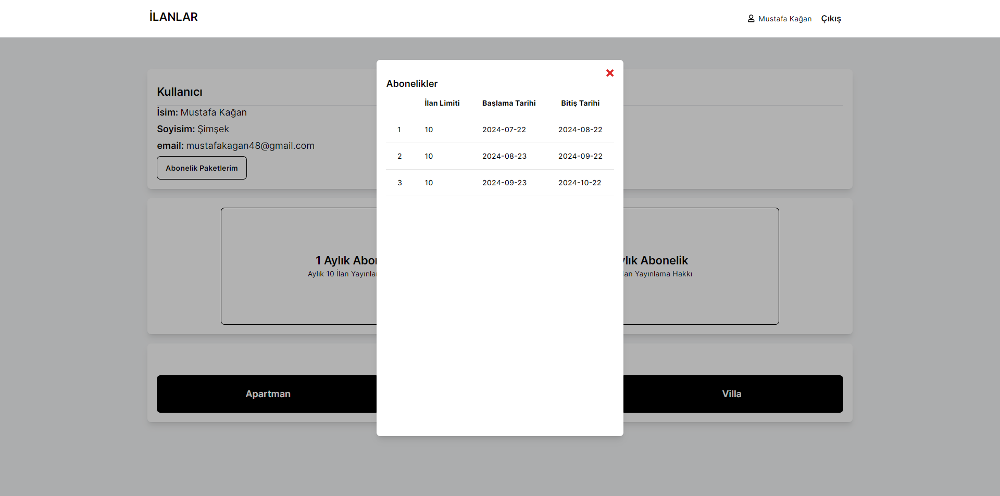
- user/{id}/ilan/guncelle/{adId}
 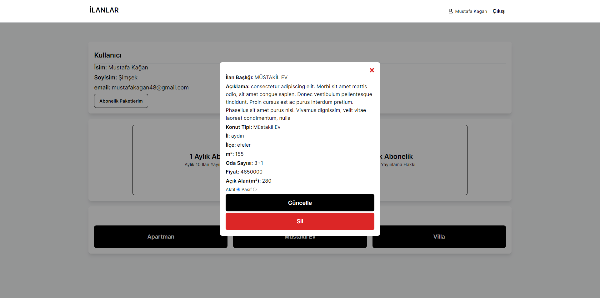
- user/{id}/payment/{amount}
 
- user/{id}/ilan-ekle/apartman

- user/{id}/ilan-ekle/mustakil-ev

- user/{id}/ilan-ekle/villa
- 
